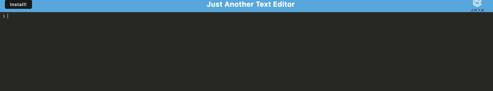
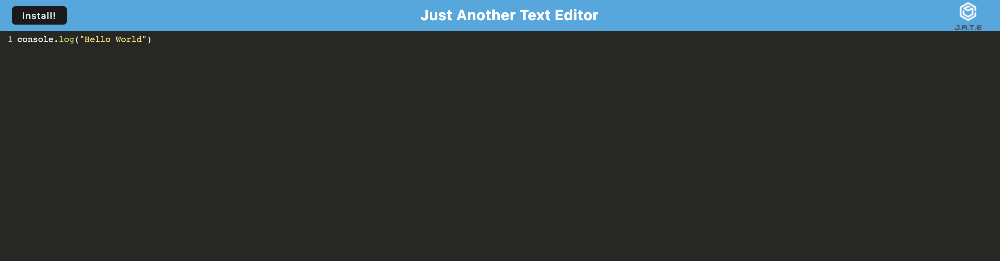

# PWA Text Editor

 

## Description

This project is a PWA app that is a text editor users can download. There is an install button the user can use to install the app and use offline.

## Table of Contents

- [Link](#link)
- [ScreenShot](#screenshot)
- [Installation](#installation)
- [Usage](#usage)
- [Credits](#credits)
- [License](#license)
- [Badges](#badges)
- [API](#api)

## Link

Below are links to the deployed app and the repo: 
[PWA_Text_Editor](https://pwa-txt-edit0r-d8f3fd166bdc.herokuapp.com/) 
[Projects_Repo](https://github.com/garciajv86/PWA_Text_Editor)

## ScreenShot
Website Screenshots:
 

## Installation

This app can be installed locally by pressing the install button.

## Usage

To use this app, just visit the provided site and start typing in the text editor or install locally by pressing the install button.

## Credits

- Joshua V. Garcia

- [My GitHub Profile](https://github.com/garciajv86)

## License

 
This project is protected under the [MIT](https://choosealicense.com/licenses/mit/) License.

## Badges

 

 
 
 
 
 
 

## API

Express, Web-Packs, Babel was the main NPM packages used for this project

- [Express Docs](https://expressjs.com/en/4x/api.html)

